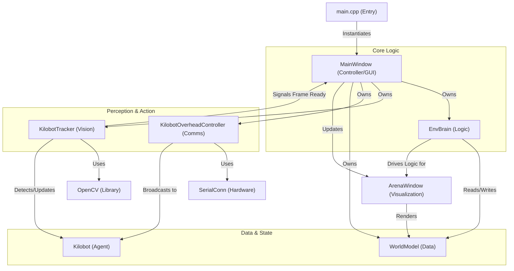

# LARS Software Architecture

The Light Augmented Reality for Swarm Systems (LARS) software is designed as a modular desktop application using the **Qt framework** (C++) for the GUI and application core, **OpenCV** for computer vision and tracking, and **Boost/igraph** for graph-based logic.

## High-Level Overview

The system follows a typical Model-View-Controller (MVC) influenced pattern, though it is heavily event-driven via Qt's signals and slots mechanism.

*   **MainWindow (Controller/View):** The central hub that orchestrates the application. It initializes other subsystems, handles user inputs, and updates the UI.
*   **EnvBrain (Logic/Model):** The "brain" of the system. It handles the virtual environment, including heatmaps, virtual pheromones, and noise. It interacts with the WorldModel.
*   **KilobotTracker (Sensing):** Uses Computer Vision (OpenCV) to track robots (Kilobots or Thymios) in real-time. It detects position, orientation, and LED status.
*   **KilobotOverheadController (Action/Communication):** Manages hardware communication to the robots via an overhead infrared controller (OHC).
*   **WorldModel (Data Store):** A shared data structure that holds the state of the world (robot positions, arena boundaries, markers).

## Component Breakdown

### 1. Main Application & GUI (`MainWindow`)
*   **Role:** Entry point and central coordinator.
*   **Responsibilities:**
    *   Initializes `EnvBrain`, `KilobotTracker`, and `KilobotOverheadController`.
    *   Manages UI elements (buttons, sliders, plots via `QCustomPlot`).
    *   Handles video viewing/recording loops.
    *   Updates the `ArenaWindow` (visualization).
*   **Key Files:** `main.cpp`, `mainwindow.h/cpp`

### 2. Logic & Environment (`EnvBrain`)
*   **Role:** Simulates the virtual environment overlay.
*   **Responsibilities:**
    *   Generates and updates heatmaps (virtual stigmergy).
    *   Adds environmental noise.
    *   Calculates geometric arrangements (grids, stars).
    *   Updates the `WorldModel` with logical states.
*   **Key Files:** `envbrain.h/cpp`

### 3. Vision & Tracking (`KilobotTracker`)
*   **Role:** The "eyes" of the system.
*   **Responsibilities:**
    *   Captures frames from camera or video files.
    *   Performs image processing (stitching, warping) using CUDA or CPU.
    *   Detects robots using shape analysis (circles) and identifiers (LEDs).
    *   Updates `Kilobot` objects with new positions and velocities.
    *   Signals `MainWindow` with new frame data.
*   **Key Files:** `tracker/robottracker.h/cpp`, `tracker/detectQR.cpp`

### 4. Hardware Abstraction (`KilobotOverheadController` & `Kilobot`)
*   **Role:** The "mouth" of the system (talking to robots).
*   **Responsibilities:**
    *   `KilobotOverheadController`: Manages serial communication with the OHC (Overhead Controller). Sends broadcast messages to swarms.
    *   `Kilobot`: Represents a single robot agent. Stores ID, position, velocity, and LED history buffers.
*   **Key Files:** `Kilobot/kilobotoverheadcontroller.h/cpp`, `Kilobot/kilobot.h`, `ohc/serialconn.h`

### 5. Data & Visualization (`WorldModel` & `ArenaWindow`)
*   **Role:** State persistence and rendering.
*   **Responsibilities:**
    *   `WorldModel`: Aggregates all state data (robot positions, arena boundaries, markers). Acts as the "ground truth".
    *   `ArenaWindow`: A QWidget specialized for rendering the AR overlay and robot states.
*   **Key Files:** `ui/worldmodel.h`, `arenaWindow.h/cpp`, `ui/renderarea.h`

## Architecture Diagram

