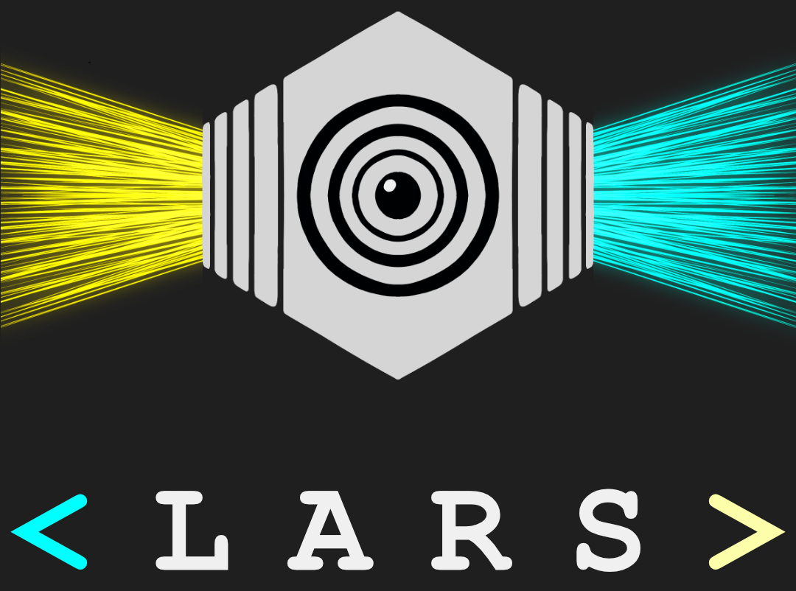
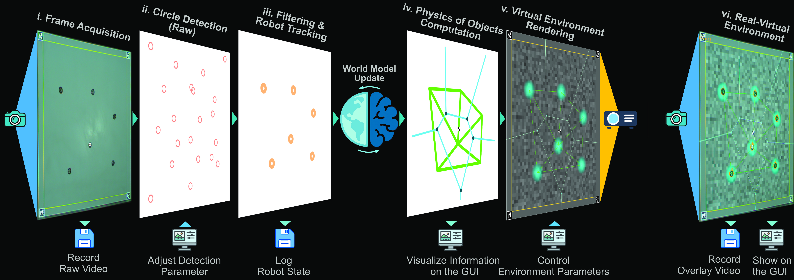

# LARS: Light-Augmented Reality System for Collective Robotics

[](https://github.com/mohsen-raoufi/LARS/actions/workflows/tests.yml)
[](https://codecov.io/gh/mohsen-raoufi/LARS)

**LARS** is an end-to-end, marker-free infrastructure designed to bridge physical robot swarms with virtual environments. It integrates high-speed detection, real-time tracking (100+ agents), and dynamic projection into a single standalone architecture.

[📄 View Online Docs](https://mohsen-raoufi.github.io/LARS/) | [📘 Read the Paper](https://www.mdpi.com/1424-8220/25/17/5412) | [📽️ Intro Video](https://www.google.com/search?q=https://figshare.com/articles/media/LARS_Light_Augmented_Reality_System_-_Introducing_LARS/30005467/1)

---



## ✨ Key Features

* **Marker-Free Tracking:** Geometry-based detection for any circular robot (Kilobots, Thymios, e-pucks).
* **High Performance:** GPU-accelerated pipeline achieving **>35 FPS** for 100+ agents.
* **Stigmergy & Interaction:** Real-time projection of virtual pheromones, gradients, and robot states.
* **Cross-Platform:** Native support for Ubuntu (x86) and NVIDIA Jetson (ARM64).

---

## 🏗️ Architecture

LARS follows a strict **Model-View-Controller (MVC)** pattern to ensure scalability and ease of hardware integration.

<p align="center">

</p>

---

## 🚀 Installation on NVIDIA Jetson (JetPack 6 / Ubuntu 22.04)

This guide provides a clean-slate setup for Jetson Nano/Orin devices.

### 1. System Preparation & Tools

Ensure your environment is up to date and install basic build tools:

```bash
sudo apt update && sudo apt install -y build-essential cmake git pkg-config
sudo apt install -y libboost-all-dev libzbar-dev libigraph-dev

```

### 2. Install Qt5 Framework

LARS is built on Qt5 Widgets.

```bash
sudo apt install -y qtbase5-dev qttools5-dev qtcreator

```

### 3. OpenCV & CUDA Requirements

> **⚠️ Critical Note:** The standard `libopencv-dev` in Ubuntu is **CPU-only**. To utilize the LARS GPU tracking engine, you must build OpenCV from source with CUDA support.

* **Quick Test (CPU Only):** `sudo apt install libopencv-dev`
* **Performance Build (Recommended):** Build OpenCV with `-D WITH_CUDA=ON`.

### 4. Build LARS

```bash
git clone https://github.com/mohsen-raoufi/LARS.git
cd LARS

# Configure for your environment in LARS.pro (Enable/Disable CUDA/Pylon)
qmake
make -j$(nproc)

```

### 5. Hardware Permissions (Crucial)

To operate the Kilobot OHC or serial devices, add your user to the `dialout` group:

```bash
sudo usermod -a -G dialout $USER
# Restart your session for changes to take effect

```

---

## 📸 Camera Configuration (Jetson Specific)

LARS supports standard USB cameras and native Jetson CSI cameras via GStreamer.

| Camera Type | Configuration in Code |
| --- | --- |
| **USB Camera** | `cv::VideoCapture cap(0);` |
| **Jetson CSI** | Use the GStreamer pipeline below |

**CSI GStreamer String:**

```cpp
"nvarguscamerasrc ! video/x-raw(memory:NVMM), width=1280, height=720, format=NV12, framerate=30/1 ! nvvidconv ! video/x-raw, format=BGRx ! videoconvert ! video/x-raw, format=BGR ! appsink"

```

---


---

## 📄 Citation

If you use LARS in your research, please cite the following:

```bibtex
@Article{raoufi2025lars,
AUTHOR = {Raoufi, Mohsen and Romanczuk, Pawel and Hamann, Heiko},
TITLE = {LARS: A Light-Augmented Reality System for Collective Robotic Interaction},
JOURNAL = {Sensors},
VOLUME = {25},
YEAR = {2025},
NUMBER = {17},
ARTICLE-NUMBER = {5412},
URL = {https://www.mdpi.com/1424-8220/25/17/5412},
DOI = {10.3390/s25175412}
}

```

---

## 🙌 Acknowledgements

Supported by the **Science of Intelligence (SCIoI)** Cluster of Excellence, Berlin. Developed and maintained by **Mohsen Raoufi**.

---
