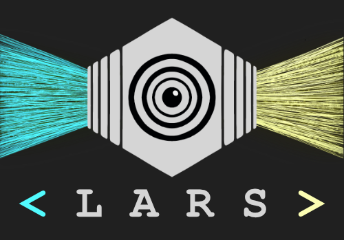
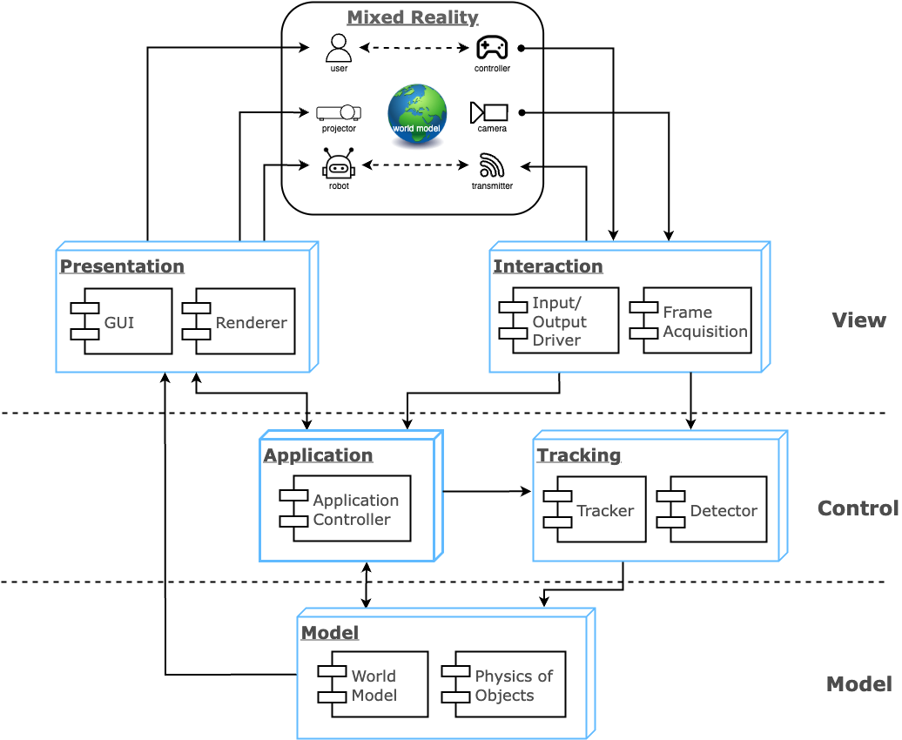
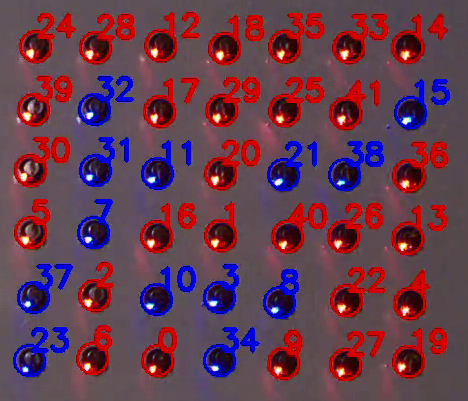
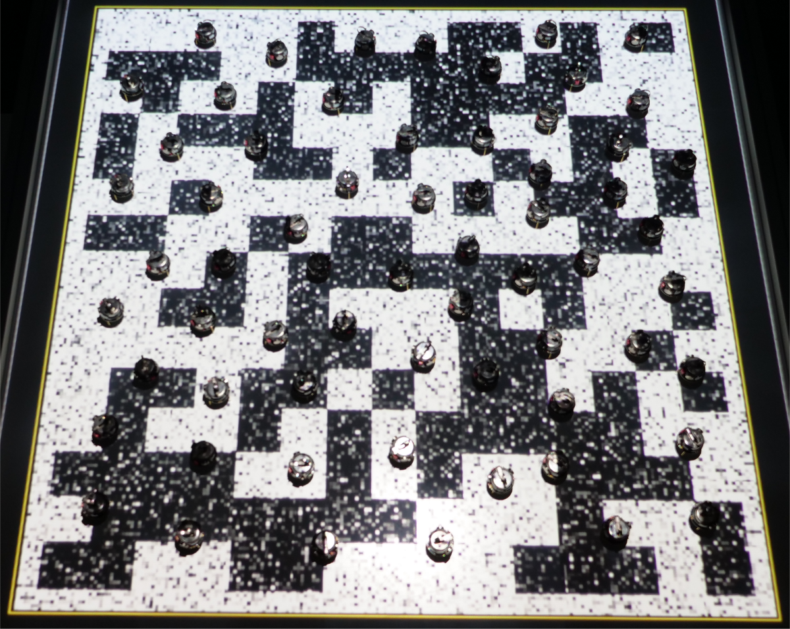
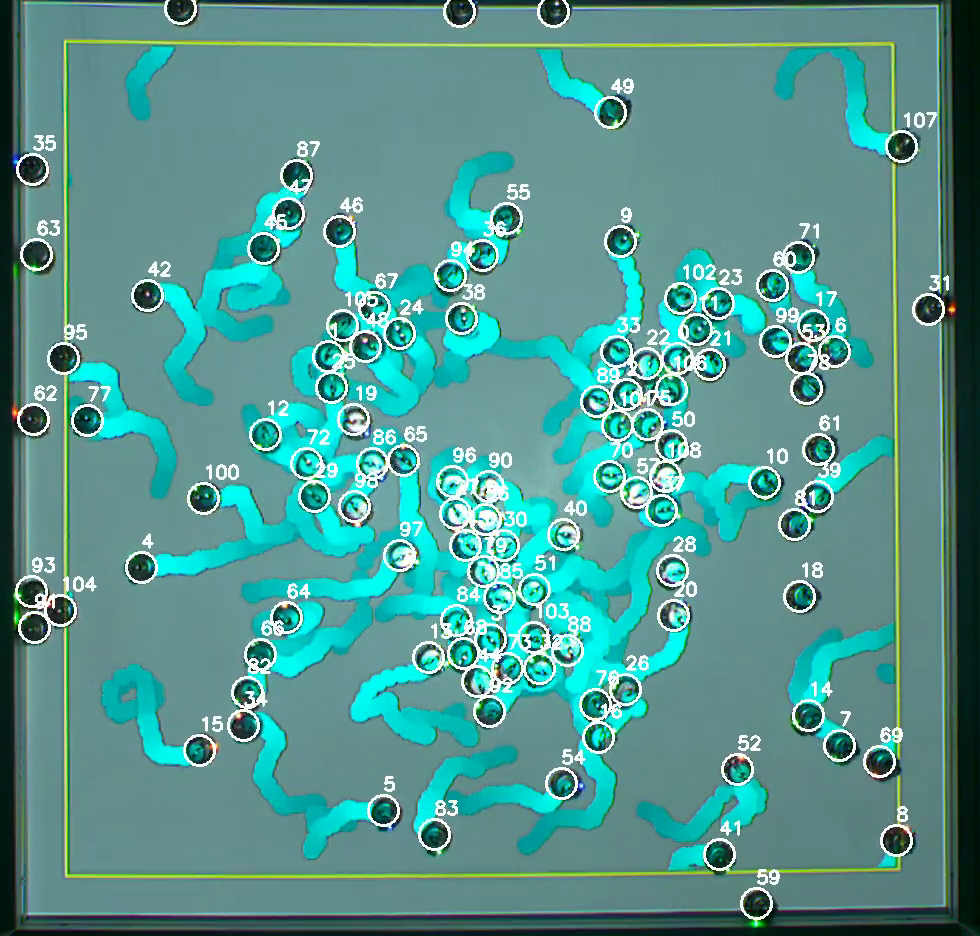
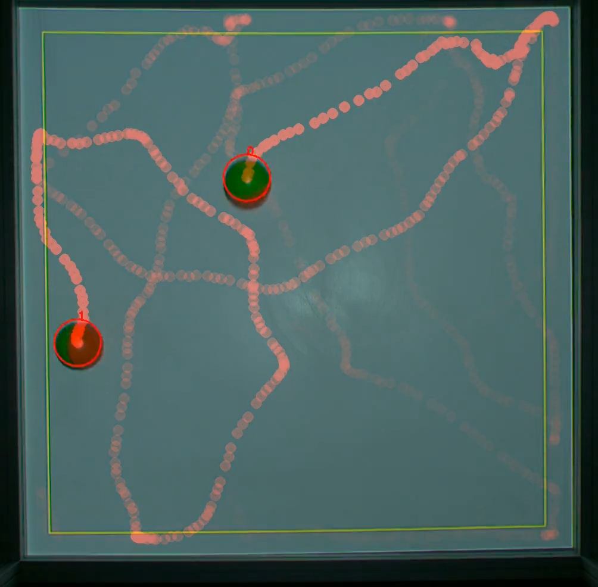
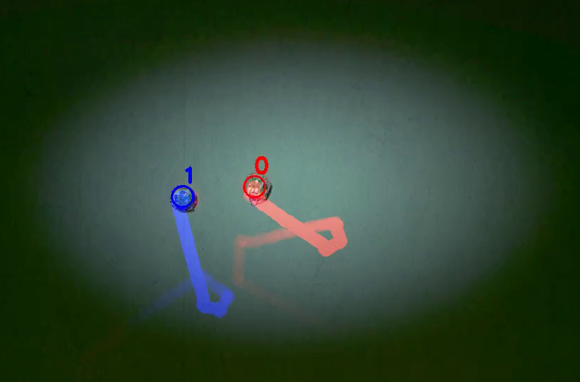
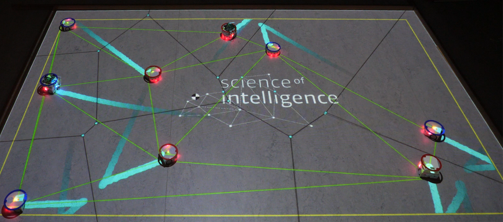

# `LARS`: Light-Augmented Reality System for Collective Robotics Interaction 🚦🤖

> **📚 Documentation**  
> Developer & API Docs: [`doxygen/html/index.html`](docs/doxygen/html/index.html)

---

<!--  -->


---

## ✨ What is LARS?

**LARS** (Light Augmented Reality System) is a cross-platform, open-source framework for *experimentation, education, and outreach* in collective robotics.  
It leverages Extended Reality (XR) to seamlessly merge the physical and virtual worlds, projecting dynamic visual objects—such as gradients, fields, trails, and even robot states—directly into the environment where real robots operate.

LARS enables **indirect robot-robot communication** (stigmergy), while preserving all real-world constraints. It turns "invisible" swarm dynamics into tangible, interactive experiences for researchers, students, and the public.

---

## 🛠️ Key Features

- **Projection of Virtual, Visual Objects** 🔦  
- **Marker-Free, Cross-platform Detection and Tracking System (based on ARK)** 🎯  
- **Real-Time Performance** ⚡  
- **Standalone System** 🖥️  
- **Scalability to Collective Size** 📈  
- **Indirect Robot-Robot (Stigmergy) 🐜 and Human-Robot Communication**  
- **Direct Communication Possibility** 📡  
- **Ease of Setup and Robustness** 🛠️  
- **Logging for Post-Production** 📝  
- **Cost Effective** 💶  
- **Open Source** 🔓  

---

## 🎯 Why LARS? (Objectives)

- **For Research:**  
  - Supporting reliability, reproducibility, and flexibility in collective robotics experiments  
  - Improving human-robot interaction  
  - Enriching environments with virtual objects—*without sacrificing realism or robot constraints*
- **For Education:**  
  - Making abstract information observable to humans  
  - Promoting science communication and public engagement by showcasing embodied collective behaviors of robots

---

## 🏹 From ARK to LARS: Advanced Multi-Robot Tracking & Visual Augmentation

LARS features a robust, real-time tracking module based on the **ARK** (Automatic Robot Kinematics) algorithm, but goes far beyond:

- ⚡ Dramatically improves speed and accuracy, supporting dense populations (100+ robots) at >35 FPS
- 🔎 Robustly handles occlusions, variable lighting, and noisy backgrounds
- 🔵 Generalizes to **any robot that appears approximately circular from above**—including Kilobots, Thymio, e-puck, and others—without the need for tags, markers, or hardware modifications
- 🏷️ Automatically preserves and recovers robot identities even during close interactions or when robots briefly leave the field of view


**Beyond tracking:**  
LARS projects **virtual visual objects** (gradients, cues, signals) in real time—directly onto the arena and the robots themselves.  
This enables:
- Simulation of virtual environments without hardware changes
- Dynamic, spatially precise feedback to individual robots or entire collectives
- Exploration of new paradigms in human-swarm and robot-environment interaction

---

## 🏗️ Architecture Overview

LARS is built on the classic **Model-View-Controller (MVC)** pattern:

- 🧩 **Model:** World state, physics, and objects  
- 🖼️ **View:** GUI, visualization, and projector output  
- 🎮 **Controller:** Experiment orchestration, tracking, and logic



---

## 🧑‍🔬 Example Scenarios

- 🗳️ **Collective Decision-Making:** Track and visualize 100+ Kilobots in a noisy, projected environment
- ⏰ **Swarm Synchronization:** Record robot states and group dynamics in real time
- 🕹️ **Interactive Demos:** Let visitors steer/interact with swarms and see collective behavior
- 🧑‍🏫 **Educational Labs:** Manipulate real experiments to teach robotics, physics, and complexity

<p align="center">
  
  
  
  
</p>
<p align="center" style="font-size: 13px;">
  (a) Kilobots synchronizing &nbsp;
  (b) Collective decision &nbsp;
  (c) 109 Kilobots snapshot &nbsp;
  (d) Active Weazle balls
</p>
<p align="center">
  
  
</p>
<p align="center" style="font-size: 13px;">
  (e) Thymios doing phototaxis &nbsp;&nbsp;
  (f) Thymios random walk
</p>

---

## 🚦 Quick Start

LARS runs as a Qt application (Qt 5.6+ recommended). Ubuntu is preferred.

See [install_dep.md](install_dep.md) for full dependency details (Qt, CUDA/OpenCV3, etc.).

```bash
git clone https://github.com/mohsen-raoufi/LARS.git
cd LARS
```

# Install dependencies (see install_dep.md)
# Build with Qt Creator (recommended) or use qmake + make


### User permission
In order to operate the Kilobot's OHC, the user needs to be part of the dialout group. Therefore, add the user to the group `dialout` with command

```
sudo usermod -a -G dialout <user-name>
```

---

## 📄 Citation

If you use or adapt LARS in your research or publications, please cite:

- Raoufi, M., Romanczuk, P., & Hamann, H. (2024). *LARS: Light Augmented Reality System for Swarm*. In Swarm Intelligence: 14th International Conference, ANTS 2024, Konstanz, Germany, October 9–11, 2024, Proceedings (Vol. 14987, p. 246). Springer Nature.

also include ARK:
- Reina A., Cope A.J., Nikolaidis E., Marshall J.A.R., Sabo C. (2017) ARK: Augmented reality for Kilobots. *IEEE Robotics and Automation Letters* **2, 1755-1761**.


---

## 🙌 Acknowledgements

LARS is supported by the *Science of Intelligence* Cluster of Excellence, Berlin.  
Developed and maintained by Mohsen Raoufi.  
Open-source under the GNU GPL v3.0.

---

## 🔗 See Also

- [Kilobot Wiki](http://diode.group.shef.ac.uk/kilobots/index.php/Kilobots)
- API Docs: [`docs/doxygen/html/index.html`](docs/doxygen/html/index.html)

---

🙌 **Contributions welcome! LARS is for scientists, educators, and all who are curious about collective intelligence in robotics.**
