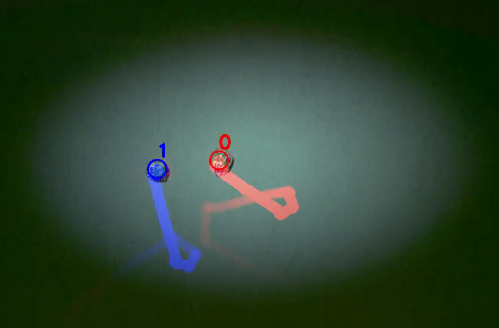

# LARS: Light-Augmented Reality System for Collective Robotics Interaction

<!--   -->

---

## What is LARS?

**LARS** (Light Augmented Reality System) is an open-source, cross-platform framework for *experimentation, education, and outreach* in collective robotics. It leverages Extended Reality (XR) to seamlessly merge the physical and virtual worlds, projecting dynamic visual objects—such as gradients, fields, trails, and even robot states—directly into the environment where real robots operate.

LARS uniquely enables **indirect robot-robot communication** (via stigmergy) while preserving all the physical and sensing constraints of actual robots. It also makes the otherwise "invisible" dynamics of multi-robot systems tangible and visible for human observers, students, and researchers.

---

## Key Features

| Feature                  | Description                                                               |
|--------------------------|---------------------------------------------------------------------------|
| **Real-time XR**         | Dynamic visual overlays and projected objects, synchronized with real robots |
| **Marker-free tracking** | Robust, high-speed (38 FPS) detection of multiple robots, no tags required  |
| **Multi-platform**       | Supports various robots (Kilobot, Thymio, E-puck, and others)              |
| **Open-source**          | Freely available for research, teaching, and public engagement             |
| **Low-cost**             | No hardware modifications, affordable components                           |
| **Reproducible**         | Full logging, video recording, and experiment reproducibility              |
| **Flexible**             | Easy configuration, extensible for new scenarios and environments          |
| **Human-friendly GUI**   | Intuitive Qt-based interface for setup, monitoring, and control            |

---

## Why LARS?

- **For Research:**  
  LARS bridges the *sim-to-real gap*, supporting reproducible, scalable multi-robot experiments and dynamic environment manipulation, all while keeping robots’ true limitations.

- **For Education:**  
  The system's visualizations transform abstract swarm dynamics into hands-on, interactive learning, perfect for classroom demonstrations and outreach events.

- **For Outreach:**  
  By projecting swarm intelligence in action, LARS makes the hidden world of robot collectives accessible and engaging to the general public.

---

## From ARK to LARS: Advanced Multi-Robot Tracking & Interactive Visual Augmentation

LARS features a robust, real-time tracking module based on the **ARK** (Automatic Robot Kinematics) algorithm.  
We have enhanced and optimized ARK to:

- Dramatically improve speed and accuracy, supporting dense populations (100+ robots)
- Robustly handle occlusions, variable lighting, and noisy backgrounds
- Generalize to **any robot that appears approximately circular from above**—including Kilobots, Thymio, e-puck, and others—without the need for tags, markers, or hardware modification
- Automatically preserve and recover robot identities even during close interactions or when robots briefly leave the field of view

**Beyond tracking:**  
LARS uniquely enables real-time projection of **virtual visual objects**—such as gradients, cues, and interactive signals—directly onto the experimental arena and atop the robots themselves.  
This allows researchers and educators to:

- Simulate virtual environments or signals without hardware changes
- Provide dynamic, spatially precise feedback to individual robots or collectives
- Explore new paradigms in human-swarm and robot-environment interaction

This flexible and general tracking-plus-augmentation system makes LARS uniquely suitable for heterogeneous and large-scale multi-robot experiments.

 

---

## Architecture Overview

LARS is built around the classic **Model-View-Controller (MVC)** pattern:

- **Model Layer:** World state and physics of virtual/real objects
- **View Layer:** Qt GUI and real-time visualization/projector outputs
- **Controller Layer:** Experiment orchestration, tracking, and logic

<!--   -->

---

## Example Scenarios

- **Collective Decision-Making**: Track and visualize 100+ Kilobots in a noisy, projected environment.
- **Robot Swarm Synchronization**: Observe and record robots’ internal states (e.g., color) and their dynamics in real-time.
- **Interactive Public Demos**: Let visitors steer or interact with live robot swarms and see their collective behavior unfold instantly.
- **Educational Labs**: Run and manipulate real robot experiments to teach concepts from physics, biology, and complex systems.

  
  
  
  

  (a) Kilobots synchronizing &nbsp;
  (b) Collective decision &nbsp;
  (c) 109 Kilobots snapshot &nbsp;
  (d) Two active Weazle balls

  
  

  (e) Thymios doing phototaxis &nbsp;&nbsp;
  (f) Thymios random walk

---

## Publications

If you use LARS in your research or teaching, please cite:

- Raoufi, M., Romanczuk, P., & Hamann, H. (2024).  
  *LARS: Light Augmented Reality System for Swarm*.  
  In Swarm Intelligence: 14th International Conference, ANTS 2024, Konstanz, Germany, October 9–11, 2024, Proceedings (Vol. 14987, p. 246). Springer Nature.

---

## Getting Started

- **[Installation Instructions](install_dep.md)** (Ubuntu recommended, Qt 5.6+, OpenCV 3.x with CUDA)
- **[Source Code & Releases](https://github.com/mohsen-raoufi/LARS)**

---

## Acknowledgements

LARS is supported by the *Science of Intelligence* Cluster of Excellence, Berlin.  
Contributors: [Mohsen Raoufi](mailto:mohsenraoufi@icloud.com).

---

*LARS is open-source under the GNU GPL v3.0. Designed for scientists, educators, and all who are curious about collective intelligence in robotics.*

---
